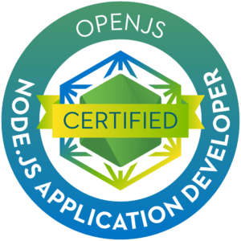

<div align="center">
    
    <h1>
        OPENJS JSNAD Certification preparation
    </h1>
</div>

## Description
This repository contains a collection of resources and tools that helped myself (and hopefuly you) prepare for the [OpenJS JSNAD (JavaScript Node.js Application Developer) certification exam](https://training.linuxfoundation.org/certification/jsnad/). The JSNAD certification is designed to validate your skills and knowledge in developing applications using Node.js and JavaScript.

## Table of Contents
1. **Buffer and Streams 11%**
    1. Node.js Buffer API's
    2. Incremental Processing
    3. Transforming Data
    4. Connecting Streams
2. **Control flow 12%**
    1. Managing asynchronous operations
    2. Control flow abstractions
3. **Child Processes 8%**
    1. Spawning or Executing child processes
    2. Child process configuration
4. **Diagnostics 6%**
    1. Debugging Node.js
    2. Basic performance analysis
5. **Error Handling 8%**
    1. Common patterns
    2. Handling errors in various scenarios
6. **Node.js CLI 4%**
    1. Node executable command line flags
7. **Events 11%**
    1. The event system
    2. Building event emitters
    3. Consuming event emitters
8. **File System 8%**
    1. Input/output
    2. Watching
9. **JavaScript Prerequisites 7%**
    1. Language fundamentals
    2. Scoped to core language features introduced since EcmaScript 1 and still heavily used today
10. **Module system 7%**
    1. CommonJS Module System only
11. **Process/Operating System 6%**
    1. Controlling the process
    2. Getting system data
12. **Package.json 6%**
    1. Package configuration
    2. Dependency management
13. **Unit Testing 6%**
    1.  Using assertions
    2.  Testing synchronous code
    3.  Testing asynchronous code 


## Folder Structure
```bash
├── public
├── src
│   ├── 01.buffer
│   ├── 02.control-flow
│   ├── 03.child-process
│   ├── 04.diagnostics
│   ├── 05.error-handling
│   ├── 06.nodejs-cli
│   ├── 07.events
│   ├── 08.file-system
│   ├── 09.javascript-prerequisites
│   ├── 10.module-system
│   ├── 11.process-operating-system
│   ├── 12.package.json
│   └── 13.unit-testing
├── .gitignore
├── LICENSE.md
├── LEARNING.md
└── README.md
```

## Learning Resources
For a more detailed list of resources, including books, articles, and online courses, please refer to the [LEARNING.md](LEARNING.md) file. This file contains links to various materials that can help you deepen your understanding of the topics covered in this repository.

## License
This project is licensed under the MIT License. See the [LICENSE](LICENSE.md) file for details.